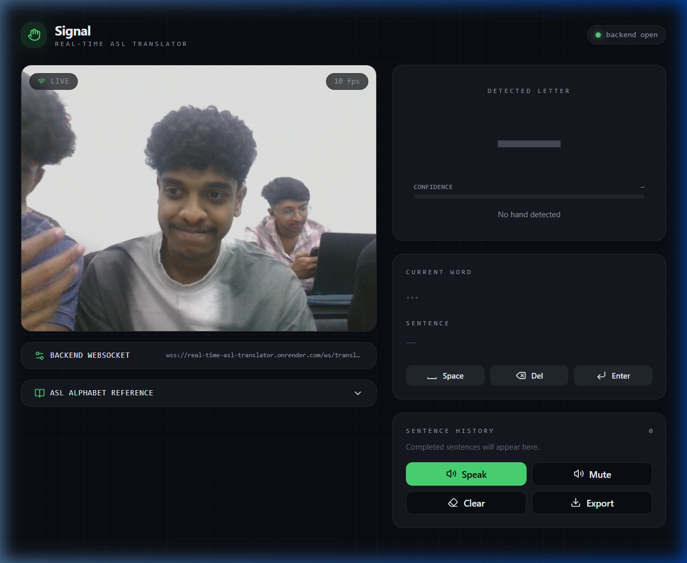

<div align="center">

# 🤟 Signal — Real-Time ASL Translator

**Translate American Sign Language gestures into text and speech in real time using your webcam.**

[](https://real-time-asl-translator.vercel.app)
[](https://real-time-asl-translator.onrender.com)
[](https://python.org)
[](https://react.dev)
[](https://tensorflow.org)

<br/>



</div>

---

## ✨ Features

| Feature | Description |
|---------|-------------|
| 🎥 **Real-Time Webcam Detection** | Captures frames at 10 FPS and streams them to the backend via WebSocket |
| 🤖 **AI-Powered Recognition** | Custom-trained TensorFlow model recognizes ASL alphabet gestures |
| ✋ **Hand Landmark Tracking** | MediaPipe overlays hand landmarks on the webcam feed for visual feedback |
| 📝 **Sentence Builder** | Automatically builds words and sentences from detected letters with smart debouncing |
| 🔊 **Text-to-Speech** | Speaks completed sentences aloud using the Web Speech API |
| 📖 **ASL Reference Guide** | Built-in ASL alphabet reference chart for learning |
| ⚙️ **Configurable Backend** | Switch between local and hosted backend URLs on the fly |
| 📤 **Transcript Export** | Download your translated text as a `.txt` file |
| 🌙 **Dark Mode UI** | Sleek, modern dark interface with glassmorphism effects |

---

## 🏗️ Architecture

```
┌─────────────────────────────┐     WebSocket (wss://)     ┌─────────────────────────────┐
│                             │ ◄──────────────────────── │                             │
│     Frontend (React)        │      Video Frames          │     Backend (FastAPI)        │
│     Vercel                  │ ────────────────────────► │     Render                   │
│                             │                            │                             │
│  • Webcam capture           │     JSON Response          │  • MediaPipe hand detection  │
│  • Landmark overlay         │ ◄──────────────────────── │  • TensorFlow inference      │
│  • Sentence building        │   {letter, confidence,     │  • Landmark extraction       │
│  • Text-to-speech           │    landmarks}              │  • Text-to-speech (gTTS)     │
│  • Transcript export        │                            │                             │
└─────────────────────────────┘                            └─────────────────────────────┘
```

---

## 🚀 Live Demo

| Service | URL | Status |
|---------|-----|--------|
| **Frontend** | [real-time-asl-translator.vercel.app](https://real-time-asl-translator.vercel.app) | ✅ Live |
| **Backend API** | [real-time-asl-translator.onrender.com](https://real-time-asl-translator.onrender.com) | ✅ Live |

> **Note:** The backend is hosted on Render's free tier and spins down after inactivity. The first request may take ~50 seconds to wake up.

---

## 📁 Project Structure

```
Real-Time-ASL-Translator/
├── sign-speak/                  # Frontend (React + Vite)
│   ├── src/
│   │   ├── components/          # UI components
│   │   │   ├── WebcamFeed.tsx        # Webcam capture & landmark overlay
│   │   │   ├── TranslationPanel.tsx  # Letter detection & sentence display
│   │   │   ├── BackendSettings.tsx   # WebSocket URL configuration
│   │   │   ├── AslReference.tsx      # ASL alphabet reference
│   │   │   ├── LandmarkOverlay.tsx   # Hand landmark visualization
│   │   │   └── ui/                   # Reusable UI primitives (shadcn/ui)
│   │   ├── hooks/
│   │   │   ├── useWebSocket.ts       # WebSocket connection management
│   │   │   └── useSpeech.ts          # Text-to-speech hook
│   │   ├── lib/
│   │   │   ├── sentenceBuilder.ts    # Letter → word → sentence logic
│   │   │   └── utils.ts             # Utility functions
│   │   ├── routes/                   # Page routes
│   │   ├── main.tsx                  # App entry point
│   │   └── styles.css               # Global styles (Tailwind CSS v4)
│   ├── index.html                    # SPA entry HTML
│   ├── vite.config.ts               # Vite build configuration
│   ├── vercel.json                  # Vercel deployment settings
│   └── package.json
│
├── asl-backend/                 # Backend (FastAPI + Python)
│   ├── app/
│   │   ├── main.py                  # FastAPI app & CORS setup
│   │   ├── routes/
│   │   │   ├── websocket.py         # WebSocket endpoint for ASL detection
│   │   │   └── tts.py               # Text-to-speech endpoint
│   │   ├── services/                # Business logic
│   │   └── utils/                   # Helper utilities
│   ├── model/
│   │   └── asl_model.h5            # Trained TensorFlow model
│   ├── requirements.txt            # Python dependencies
│   ├── Dockerfile                  # Docker config for Render
│   └── README.md
│
└── docs/
    └── screenshot.png              # App screenshot
```

---

## 🛠️ Tech Stack

### Frontend
| Technology | Purpose |
|------------|---------|
| **React 19** | UI framework |
| **Vite 6** | Build tool & dev server |
| **TypeScript** | Type safety |
| **Tailwind CSS v4** | Styling |
| **TanStack Router** | Client-side routing |
| **shadcn/ui** | Pre-built UI components |
| **Lucide React** | Icon library |
| **Web Speech API** | Text-to-speech |

### Backend
| Technology | Purpose |
|------------|---------|
| **FastAPI** | Web framework & WebSocket server |
| **TensorFlow 2.17** | ASL gesture classification model |
| **MediaPipe** | Hand detection & landmark extraction |
| **OpenCV** | Image processing |
| **gTTS** | Google Text-to-Speech |
| **Uvicorn** | ASGI server |

### Deployment
| Service | Purpose |
|---------|---------|
| **Vercel** | Frontend hosting (SPA) |
| **Render** | Backend hosting (Docker) |
| **GitHub** | Source control & CI/CD |

---

## 🏃‍♂️ Getting Started

### Prerequisites

- **Node.js** ≥ 18
- **Python** 3.9–3.11 (TensorFlow/MediaPipe requirement)
- **npm** or **yarn**

### 1. Clone the Repository

```bash
git clone https://github.com/Monish892/Real-Time-ASL-Translator.git
cd Real-Time-ASL-Translator
```

### 2. Set Up the Backend

```bash
cd asl-backend

# Create a virtual environment
python -m venv venv
source venv/bin/activate  # On Windows: venv\Scripts\activate

# Install dependencies
pip install -r requirements.txt

# Place your trained model
# Put your asl_model.h5 file in the model/ directory

# Start the server
uvicorn app.main:app --reload --port 8000
```

The backend will be available at `http://localhost:8000` and `ws://localhost:8000/ws/translate`.

### 3. Set Up the Frontend

```bash
cd sign-speak

# Install dependencies
npm install

# Start the dev server
npm run dev
```

The frontend will open at `http://localhost:5173`.

### 4. Configure the WebSocket

By default, the frontend connects to the production backend. To use your local backend:
1. Click the **Backend WebSocket** settings panel in the UI
2. Enter `ws://localhost:8000/ws/translate`
3. Click **Save**

---

## 🔧 Environment Variables

### Frontend
| Variable | Default | Description |
|----------|---------|-------------|
| `VITE_WS_URL` | `wss://real-time-asl-translator.onrender.com/ws/translate` | WebSocket URL for the backend |

### Backend
No environment variables required for basic setup.

---

## 📦 Deployment

### Frontend → Vercel

1. Import the GitHub repository on [Vercel](https://vercel.com)
2. Set **Root Directory** to `sign-speak`
3. Set **Framework Preset** to `Vite`
4. Deploy 🚀

### Backend → Render

1. Create a new **Web Service** on [Render](https://render.com)
2. Connect to the GitHub repository
3. Set **Root Directory** to `asl-backend`
4. Set **Runtime** to `Docker`
5. Deploy 🚀

---

## 🧠 How It Works

1. **Webcam Capture** — The frontend captures video frames at 10 FPS from the user's webcam
2. **WebSocket Streaming** — Each frame is sent as a base64-encoded image to the backend via WebSocket
3. **Hand Detection** — MediaPipe detects hand landmarks in the frame
4. **Gesture Classification** — The TensorFlow model classifies the hand pose into an ASL letter (A–Z)
5. **Response** — The backend returns the predicted letter, confidence score, and hand landmarks
6. **Sentence Building** — The frontend assembles letters into words and sentences with smart debouncing (1.5s hold to confirm a letter)
7. **Text-to-Speech** — Completed sentences are read aloud using the browser's Speech Synthesis API
8. **Landmark Overlay** — Hand landmarks are drawn on the webcam feed for real-time visual feedback

---

## 🤝 Contributing

1. Fork the repository
2. Create your feature branch (`git checkout -b feature/amazing-feature`)
3. Commit your changes (`git commit -m 'Add amazing feature'`)
4. Push to the branch (`git push origin feature/amazing-feature`)
5. Open a Pull Request

---

## 📄 License

This project is open source and available under the [MIT License](LICENSE).

---

<div align="center">

**Built with ❤️ by [Monish](https://github.com/Monish892)**

</div>
